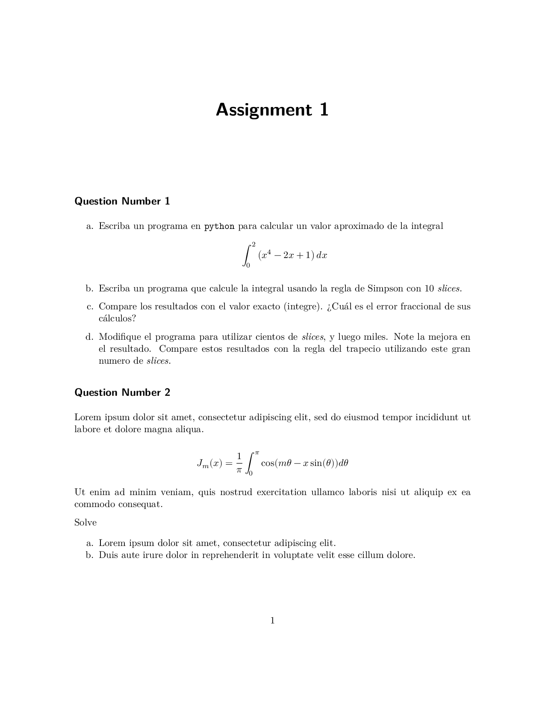

# uofa-eng-assignment

A Quarto template for University of Alberta engineering assignments.

Originally an Overleaf/LaTeX template, now converted to Quarto for easier document creation and modern publishing workflows.

## Preview

Here's what a rendered assignment looks like:

[](preview.pdf)

*Click the image to view the full PDF*

## Installing

To use this template, you can install it directly from GitHub:

```bash
quarto use template Dagwbl/uofa-eng-assignment
```

This will install the extension and create an example qmd file that you can use as a starting place for your assignment.

## Using

After installing, create or edit a `.qmd` file with the following YAML header:

```yaml
---
title: "Assignment 1"
format:
  uofa-eng-assignment-pdf: default
author: "Your Name"
student-id: "1234567"
course: "Course Name (Course Code)"
assignment: "Assignment Number"
date: "2024-01-15"  # Optional
---
```

Then render your document:

```bash
quarto render your-file.qmd
```

## Format Options

The template supports the following metadata fields:

- `author` or `student-name`: Your full name (use `author` for compatibility with standard Quarto documents)
- `student-id`: Your student ID number
- `course`: Full course name and code
- `assignment`: Assignment number or title
- `date`: (Optional) Assignment date

## Features

- Custom title page with student information and UofA Engineering logo
- Support for mathematical equations (via amsmath, amsfonts, amssymb)
- Support for Greek Unicode characters in text mode (via textgreek)
- Code syntax highlighting (Quarto's default)
- Compatible with all standard Quarto/Pandoc markdown features

## Advanced Usage

If you need to use advanced LaTeX packages that were commented out to avoid conflicts, you can add them back by modifying `_extensions/uofa-eng-assignment/uofa-eng-assignment.tex`. Packages that may conflict with Quarto's code highlighting include:

- `fancybox` - conflicts with verbatim environments
- `pstricks` and `pst-plot` - may interfere with syntax highlighting
- `listings` - conflicts with Quarto's default code highlighting (use Quarto's native code blocks instead)

## Example

See [template.qmd](template.qmd) for a complete example.

## Original LaTeX Template

The original Overleaf template can be found at:
https://www.overleaf.com/latex/templates/homework-assignment-university-of-alberta-engineering/nhjgtbxrfwqc
